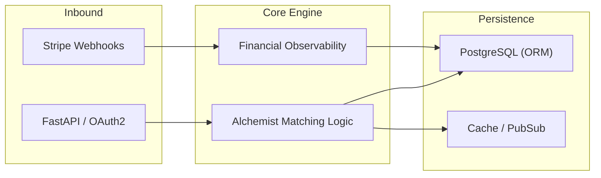

# 🧪 Alkimia Backend - Financial Observability Architecture

## 1. System Overview
Alkimia acts as the orchestrator for financial visibility and matching logic within the Castle Trade ecosystem.

## 2. Technical Stack
- **Framework**: FastAPI (Asynchronous Python 3.12).
- **Communication**: Event-driven architecture for webhook processing.
- **Observability**: Centralized logging for financial state transitions and audit trails.

---
*Castle Trade LLC - Engineering Quality Standard.*
